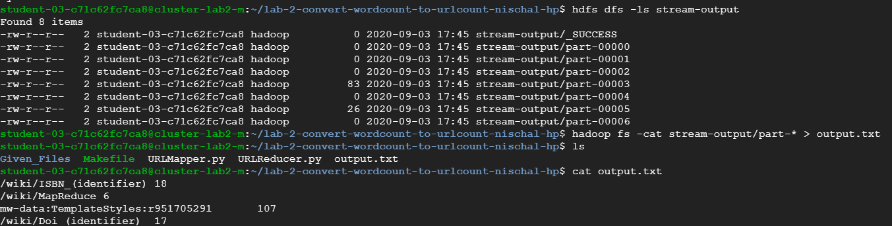

# Lab 2 - Convert WordCount to UrlCount
I implemented the Streaming version of this problem and the changes I made to the program are listed below.
## Steps to covert WordCount to UrlCount:

### Following changes were made in Mapper.py:
* For each of the word, check if string "href" is present in it or not. This will indicate a URL link being present.
* Next, extract out the content present between double quotes, as this indicates the actual URL and send it across the STDOUT.

### Following changes were made in Reducer.py:
* Send only those URL's to STDOUT whose count is greater than 5, as required.
* Remove the last 2 lines of code which was written to add the last word if present. This is not required in this scenario, as the minimum count has to be 5.
## Software needed to run the program:
Hadoop, Python/Java, Git

## Steps to run the code in Dataproc Cluster:
* Create a new cluster by running the following command
```
gcloud dataproc clusters create cluster-lab2 --scopes cloud-platform --region global
```
* SSH into the Master node and clone the required repo.
* Create a new directory in the HDFS by running the command -
```
hdfs dfs -mkdir hdfs://cluster-lab2-m/user/$user  (Replace $user with the actual username) 
```
* Run "make prepare" command to generate the input directory
* Run "time make stream" command to time the result.
* Observe the output partitions by running the command
```
hdfs dfs -ls stream-output
```
* Combine the output obtained from different partitions into a single output text file
```
hadoop fs -cat stream-output/part-* > output.txt
```
* Check the output file by running the command - "cat output.txt"
## Problems with Java URLCount implementation with Combiner
Previously for Word Count, the same class was used as a Combiner as well as Reducer; and this did not throw any error. But if we do the same thing with the URL Count Implementation, then this will cause few of the URL's to not be displayed in the output. This is because of the condition mentioned in the Reducer, wherein only those URL's whose count is greater than 5 are sent across. Usage of this condition in the combiner phase causes the problem. This is because, Combiner does not see all the entries belonging to a particular key. It sees the output from a single mapper and combines it, before it is sent across to the Reducer phase. As a result, there maybe certain URL's whose count is lesser than 5 in the Mapper phase; but they may have duplicate entries in another mapper and their combined count would be greater than 5. Thus, using the same class as combiner and reducer will cause problem to output these kinds of URL's. Hence, we need to create two different classes for Combiner and Reducer for the Java implementation.


## Output Snapshots

### Time taken for execution with 1 master and 2 worker nodes:


### Time taken for execution with 1 master and 4 worker nodes:


### Output with 1 master and 2 worker nodes:


### Output with 1 master and 4 worker nodes:


### Conclusion
* Using Hadoop for a small job like the URL counter on 2 wikipedia files, actually takes up lots of time for execution. In fact, it is more than the time taken on a single machine. This is because additional time is required to split up the input and assign it to various machines, do a scheduling between them and shuffling also takes place in the reducer phase which takes up a bit more time. 
* By changing worker nodes from 2 to 4, almost 10s of real execution time is saved; and this is visible in the screenshot attached. 
* Another point to note is that, using streaming version takes up more time for execution than using the Java version. This is because it spins up multiple Python processes, which is not the case with the Java implementation.

## References
* https://stackabuse.com/python-check-if-string-contains-substring/
* https://stackoverflow.com/questions/2076343/extract-string-from-between-quotations

## People Worked With
Ketan Ramesh